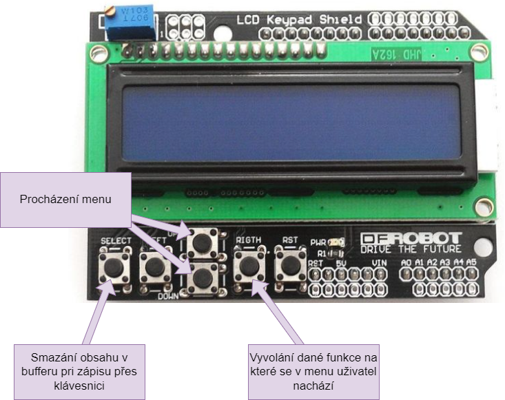
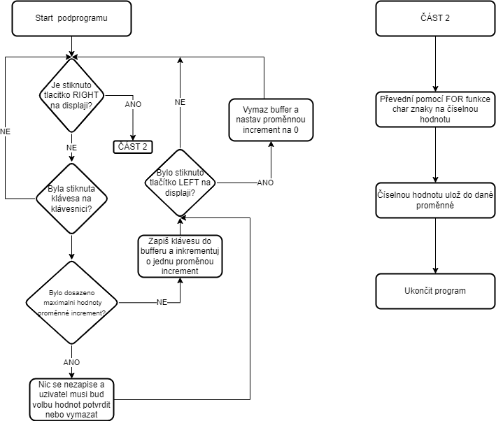
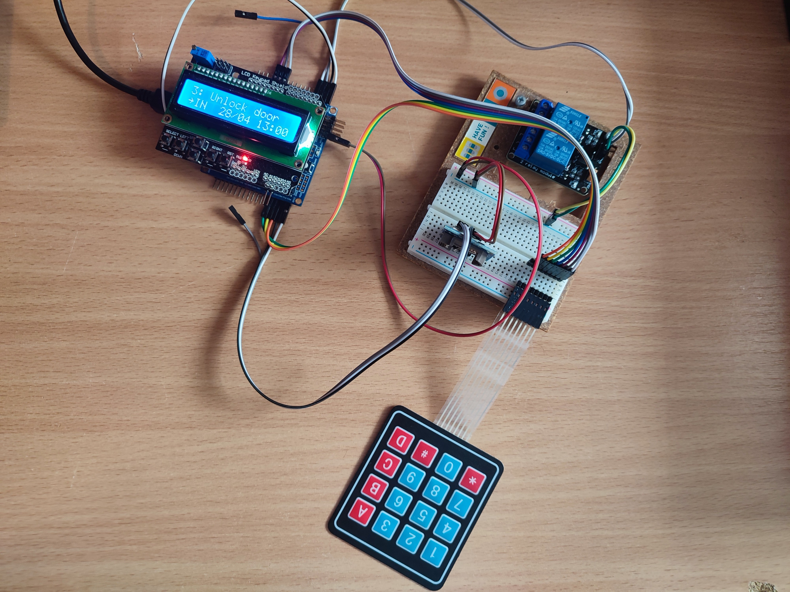

# Projekt - zabezpečení dveří
## Návod na použití

### Obsluha a procházeni menu


### Jak systém používat
Samotný systém je plně funkční ačkoliv má defuaultně nastavené některé hodnoty.
**Defaultně nastavené hodnoty:**
<ul>
  <li>Lock time - při spuštění je nastavený na 7:30 (lze měnit za běhu)</li>
  <li>Unock time - při spuštění je nastavený na 19:30 (lze měnit za běhu)</li>
  <li>Admin password - defaultně nastavené v programu (nelze za běhu měnit)</li>
  <li>Prvnotní nastavení času - na jakou hodnotu mají být nastavené RTC hodiny (nelze za běhu měnit)</li>
</ul>

Systém umožnuje otevření dvěří na zadání admin hesla. Pokud je k tomu zapnutý i alarm tak je po 3 nepovedených pokusech vyhlášen poplach. Samotný alarm je pak možné vypnout přímo z meny ale je potřeba opět zadat příslušné heslo. Samotné hlavní možnosti v menu jsou poté níže popsány v sekci **Uživatelské rozhraní**.

### Zapojení systému
Ideální je aby všechny komponenty byly zapojeny podle schématu v kapitole **Schéma zapojení**. Pokud by došlo k úpravě samotného zapojení je nutné upravit jednolitvé piny v programu.
### Prvotní zapnutí systému
Po prvotním spuštění systému se uživatel dostane hnedka  do hlavního menu celého systému. Odtut se může pak libovolně ovládat vše co systém nabízí. Samotná klávesnice se použí pouze pokud vás systém vyzve k nastavení času nebo zadání hesla, jinak je po celou dobu klávesnice nefunkční. 
## Požadavky
- [X] Systém bude umožňovat odemknout nebo zamknout dveře (Relé 1) a zapnout nebo vypnout alarm (Relé 2)
- [ ] Systém může využívat více uživatelů z nichž každý může mít vlastní přístupové heslo. Systém si hesla a uživatele pamatuje i po odpojení napájení.
- [X] Heslo může mít minimálně 4 a maximálně 16 znaků.
- [X] V případě trojnásobného zadání chybného kódu bude vyhlášen alarm. Alarm půjde zrušit zadáním správného kódu.
- [X] Informace o odemčení, uzamčení, vyhlášení alarmu a nebo jeho zrušení včetně času události budou vysílány po sériové lince.
- [X] Systém umožní automatické odemknutí nebo zamknutí dveří v předem nastavený čas. (Automatické odkódování a zakódování)
- [X] Nastavení funkcí a ovládání prostřednictvím vhodné periferie a displeje.
- [ ] Přidat nebo smazat uživatele bude možné pomocí sériové linky.

## Schema zapojeni


## FlowCharty
Zde budou ukázány jednotlivé flow programů a podprogramů použitých v projektu.
### Digram hlavního programu

### Čtení z klávesnice

## Popis řešení
Tato část se bude podrobněji věnovat jednotlivým částem samotného systému. Budou zde i popoisováný jednotlivé funkce například pro vyčítání hesla nebo nastavení času s pomocí klávesnice. Bohužel u klávesnice byl vynechán jedne řádek a jeden sloupec a to kvůli tomu aby se vše potřebné dalo napojit na jeden mikročip.
### Použíté komponenty
<ul>
  <li>Microchip Atmega328P</li>
  <li>16x2 LCD display s budičem HD44780</li>
  <li>Maticová klávesnice</li>
  <li>Hodiny RTC DS1307</li>
  <li>Relé modul </li>
</ul>

### Uživatelské rozhraní
Celé uživatelské rozhraní je vytvářené přes LCD display aby uživatel jej mohl používat bez potřeby s sebou nosit PC. V hlavním menu je hned několik částí:
<ul>
  <li>ADD user - přídání uživatele</li>
  <li>Remove user - odebrání uživatele</li>
  <li>Unlock door - otevření dvěří</li>
  <li>Lock time - nastavení automatického času pro zamykání</li>
  <li>Unlock time - nastavení automatického času pro odemikání</li>
  <li>Alarm ON - zapnutí alarmu</li>
  <li>Alarm OFF - vypnutí alarmu</li>
  <li>Show/loc-unl - zobrazení jednotlivých časů pro automatické zamknutí a odemknutí dvěří</li>
</ul>

### Obsluha hesla nebo nastavení času
````C
```
void readButton_buffer(int leng_of_increment, int statemant){
	while (1){
		int lcd_button = readButton();
		char get_key =  matrix_keypad_getkey();
		if (get_key != '\0' && increment < leng_of_increment)
		{
			buffer[increment] = get_key;
			lcd_set_cursor(1,0);
			fprintf(&lcd_out, (char*)buffer);
			increment++;
		}
		else if (lcd_button == 5)
		{
			lcd_clear();
			lcd_home();
			switch(statemant){
				case 1:
					fprintf(&lcd_out, "Set hour xx:");
					break;
				case 2:
					fprintf(&lcd_out, "Set minutes xx:");
					break;
				case 3:
					fprintf(&lcd_out, "Write pass: at:%d", strikes);
			}
			memset(buffer, 0, sizeof(buffer));
			increment = 0;
		}
		if(lcd_button == 4){
			break;
		}
		delay(50);
	}
}
```
````
**Vstupní proměnné:**
<ul>
  <li>leng_of_increment - maximální délka po jakou má být naplněný buffer</li>
  <li>statemant - určení o jaký typ se jedná (lock time, unlock time, password)</li>
</ul>

**Popis:**

### Přemena znakového hesla na číselné
````C
```
for (i = 0; buffer[i] != '\0'; i++) {
	result = result * 10 + (buffer[i] - '0');
}
```
````

**Popis:**
Kod výše vezme dané pole charů a postupně jej prochází od prvního po poslední. Každé potom číslo, které vznikne z jendoho charu je ukládáno do proměnné result, která je typu int, a během každé iterace co je procházen buffer je hodnota result zvětšena 10x. To nám zapříčíní že například pokud by jsme měli v bufferu uložené znaky ['1','2']. Tak nejprve se nám do pole uloží číslo 1 a v druhé iteraci se z něj stane číslo 10 a k němu je poté příčteno číslo 2.

### Automatické odemykání a zamykání dvěří
````C
```
void check_lock_unlock_time(uint8_t rtc_data[], int* relay[2], int unlock_lock_time[4]){
	uint8_t rtc_minutes = bcd2dec(rtc_data[1]);
	uint8_t rtc_hours = bcd2dec(rtc_data[2]);

	if(unlock_lock_time[0] <= rtc_hours && rtc_hours <= unlock_lock_time[2] && relay[0] == 0)
	{	
		if (rtc_hours == unlock_lock_time[0] && rtc_minutes >= unlock_lock_time[1]){
			if(rtc_hours == unlock_lock_time[2]){
				if (rtc_minutes < unlock_lock_time[3])
				{
					relay[0] = 1;
					printf("Automaticke odemceni 1 \n");
					unlock_door(rtc_data);
				}
			}else
			{
				relay[0] = 1;
				printf("Automaticke odemceni 2 \n");
				unlock_door(rtc_data);
			}
			
		}else if (rtc_hours != unlock_lock_time[0])
		{
			if(rtc_hours == unlock_lock_time[2]){
				if (rtc_minutes < unlock_lock_time[3])
				{
					relay[0] = 1;
					printf("Automaticke odemceni 3 \n");
					unlock_door(rtc_data);
				}
			}else
			{
				relay[0] = 1;
				printf("Automaticke odemceni 4 \n");
				unlock_door(rtc_data);
			}		
		}
	}else if (rtc_hours >= unlock_lock_time[2] && rtc_minutes >= unlock_lock_time[3] && relay[0] == 1)
	{
		relay[0] = 0;
		printf("Automaticke zamceni \n");
		lock_door(rtc_data);
	}	
}
```
````
**Vstupní proměnné:**
<ul>
  <li>rtc_data - pole ve kterém jsou uloženy údaje o čase </li>
  <li>relay - pole ve kterém jsou uloženy aktuální stavy relátek </li>
  <li>unlock_lock_time - pole ve kterém jsou uloženy časy pro automatické zamknutí nebo odemknutí dveří </li>
</ul>

**Popis:**
Tato část kódu slouží ke kontrole automatického odemykání a zamykání dveří na předem stanovený čas. Všechny kontroly jsou vztaženy k proměnné unlock_lock_time, které je typu int a jedná se pole s celkovým počtem 4 hodnot.
Ukázka proměnné unlock_lock_time:
**unlock_lock_time[0]** - hodina při které se mají dveře odemknout 
**unlock_lock_time[1]** - minuta při které se mají dveře odemknout
**unlock_lock_time[2]** - hodina pří které se mají dveře zamknout
**unlock_lock_time[3]** - minuta pří které se mají dveře zamknout

### Aktualizace času s hlášením chyby
````C
```
void update_time(void){
		err = twi_read(RTC_ADRESS, 0x00, rtc_data, sizeof(rtc_data)); // cteni z RTC data jsou nasledne ulozena do rtc_data
		if(err != TWI_OK) // kontrola zda pri cteni nenastala chyba
		{
			memset(print_buffer, 0, sizeof(print_buffer)); // vymazani bufferu
			sprintf(print_buffer, "%d error %d \r\n\n", __LINE__,err); // vypsani erroru po uartu
			printf((uint8_t*)print_buffer); // vypsani bufferu na uart
			//while(1); //nekonecna smycka
		}
}
```
````
**Popis:**
Funkce pro aktualizaci času využívá modul RTC DS1307 a komunikuje s ním pomocí I2C sběrnice. Pokud by nastala při komunikaci chyba bude poslána přes UART chybová hláška.
## Zhodnocení celého systému
### Ukázka zapojení


### Slovní zhodnocení
Osobně jsem velmi podcenil čas, který je na tento projekt potřeba. Kvůli tomu jsem celý projekt nedotáhl do knce a některé části mu chybí. Části které nebyly dokončeny tak jeukládání dat do EEPROM a poté možnost více jak jednoho uživatele. Ikdyž to se mi vzhledem k tomu jak fungují takovéto zámky na budovách tak nezdá až taková nutnost podporovat vícew uživatelů. Snaha byla v projektu ošwtři všechny možné situace co by mohli nastat a aby nedocházelo k zbytečnému spínaní některých funkcí když to nebude žádoucí. Například otevření dvěří pokud jsou již otevřeny automaticky. Nejvíce jsem se pral s ověřením hesla aby to spráně fungovalo a umožnovalo to více pokusů a poté taky aby nedocházelo k chybám při automatickém otevírání a uzavírání dveří. Pokud by jsme chtěli aby se nám čas ukládal je nutné ješte přidat baterku k RTC modulu. Bohužel jsem jí doma nedisponoval takže jsem tuto možnost ani do systému neimplementoval že by počítal s nastaveným časem z minulého chodu. To by se dalo dělat ukládáním nějaké proměnné do paměti, která by nám řekla zda byl čas již nastaven nebo nikoliv. Pořípadě v programu nechat nastavovat přes klávesnici.